# Event Persistence (D1) Flowchart

## Sources Consulted

| File | Lines Read |
|------|------------|
| `src/events.ts` | 1-306 (entire file) |
| `src/types.ts` | 1-316 (entire file) |

## Flowchart

```mermaid
flowchart TD
    subgraph insertEvent["insertEvent()"]
        IE_ENTRY["insertEvent(env, event)<br/>events.ts:91"]
        IE_GET_PAYLOAD["Get payload from event<br/>events.ts:95"]
        IE_GET_FINISHED["getFinishedPayload(event)<br/>events.ts:96"]
        IE_CHECK_FINISHED{"isFinishedWebhook?<br/>types.ts:51-55"}
        IE_RETURN_PAYLOAD["Return payload<br/>events.ts:46"]
        IE_RETURN_NULL["Return null<br/>events.ts:46"]
        IE_GET_ACTIONS["getActionCounts(finishedPayload)<br/>events.ts:97"]
        IE_CALC_ACTIONS["Calculate failed/total counts<br/>events.ts:49-58"]
        IE_D1_INSERT["D1 INSERT INTO events<br/>events.ts:99-151"]
        IE_BIND["Bind 23 columns<br/>events.ts:126-150"]
        IE_RUN["DB.run()<br/>events.ts:151"]
        IE_END["Return void<br/>events.ts:152"]
        
        IE_ENTRY --> IE_GET_PAYLOAD
        IE_GET_PAYLOAD --> IE_GET_FINISHED
        IE_GET_FINISHED --> IE_CHECK_FINISHED
        IE_CHECK_FINISHED -->|Yes| IE_RETURN_PAYLOAD
        IE_CHECK_FINISHED -->|No| IE_RETURN_NULL
        IE_RETURN_PAYLOAD --> IE_GET_ACTIONS
        IE_RETURN_NULL --> IE_GET_ACTIONS
        IE_GET_ACTIONS --> IE_CALC_ACTIONS
        IE_CALC_ACTIONS --> IE_D1_INSERT
        IE_D1_INSERT --> IE_BIND
        IE_BIND --> IE_RUN
        IE_RUN --> IE_END
    end
    
    subgraph fetchEvents["fetchEvents()"]
        FE_ENTRY["fetchEvents(env, options)<br/>events.ts:154"]
        FE_NORMALIZE["Normalize options<br/>events.ts:158-159"]
        FE_CLAMP["clampInteger(limit, offset)<br/>events.ts:160-161"]
        FE_INIT_CLAUSES["Init clauses/bindings<br/>events.ts:162-163"]
        FE_STARTED{"eventType = started?<br/>events.ts:165"}
        FE_ADD_STARTED["Add started filter<br/>events.ts:166-167"]
        FE_FINISHED{"eventType = finished?<br/>events.ts:170"}
        FE_ADD_FINISHED["Add finished filter<br/>events.ts:171-172"]
        FE_FAILED{"eventType = failed?<br/>events.ts:175"}
        FE_ADD_FAILED["Add has_failed_actions=1<br/>events.ts:176-177"]
        FE_LIKE_FILTERS["addLikeFilter() x3<br/>events.ts:179-181"]
        FE_TIME_CUTOFF["getTimeRangeCutoff()<br/>events.ts:183"]
        FE_ADD_TIME{"cutoff not null?<br/>events.ts:184"}
        FE_TIME_CLAUSE["Add timestamp >= ?<br/>events.ts:185-186"]
        FE_ARCHIVE{"archived filter?<br/>events.ts:190"}
        FE_ADD_ARCHIVE["Add is_archived = 0<br/>events.ts:191"]
        FE_SEARCH{"search provided?<br/>events.ts:194"}
        FE_ADD_SEARCH["Add LIKE clauses x5<br/>events.ts:196-205"]
        FE_BUILD_WHERE["Build WHERE clause<br/>events.ts:207"]
        FE_D1_SELECT["D1 SELECT event_id,<br/>timestamp, payload_json<br/>events.ts:208-216"]
        FE_PARSE_RESULTS["Parse results<br/>events.ts:218-240"]
        FE_MAP["Map rows to StoredEvent<br/>events.ts:219-239"]
        FE_JSON_PARSE["JSON.parse(payload_json)<br/>events.ts:221"]
        FE_VALIDATE{"Valid payload?<br/>events.ts:223-228"}
        FE_RETURN_EVENT["Return StoredEvent<br/>events.ts:229-233"]
        FE_CATCH["catch: return null<br/>events.ts:235-236"]
        FE_FILTER["Filter nulls<br/>events.ts:240"]
        FE_END["Return StoredEvent[]<br/>events.ts:241"]
        
        FE_ENTRY --> FE_NORMALIZE
        FE_NORMALIZE --> FE_CLAMP
        FE_CLAMP --> FE_INIT_CLAUSES
        FE_INIT_CLAUSES --> FE_STARTED
        FE_STARTED -->|Yes| FE_ADD_STARTED
        FE_STARTED -->|No| FE_FINISHED
        FE_ADD_STARTED --> FE_FINISHED
        FE_FINISHED -->|Yes| FE_ADD_FINISHED
        FE_FINISHED -->|No| FE_FAILED
        FE_ADD_FINISHED --> FE_FAILED
        FE_FAILED -->|Yes| FE_ADD_FAILED
        FE_FAILED -->|No| FE_LIKE_FILTERS
        FE_ADD_FAILED --> FE_LIKE_FILTERS
        FE_LIKE_FILTERS --> FE_TIME_CUTOFF
        FE_TIME_CUTOFF --> FE_ADD_TIME
        FE_ADD_TIME -->|Yes| FE_TIME_CLAUSE
        FE_ADD_TIME -->|No| FE_ARCHIVE
        FE_TIME_CLAUSE --> FE_ARCHIVE
        FE_ARCHIVE -->|Not archived| FE_ADD_ARCHIVE
        FE_ARCHIVE -->|Archived| FE_SEARCH
        FE_ADD_ARCHIVE --> FE_SEARCH
        FE_SEARCH -->|Yes| FE_ADD_SEARCH
        FE_SEARCH -->|No| FE_BUILD_WHERE
        FE_ADD_SEARCH --> FE_BUILD_WHERE
        FE_BUILD_WHERE --> FE_D1_SELECT
        FE_D1_SELECT --> FE_PARSE_RESULTS
        FE_PARSE_RESULTS --> FE_MAP
        FE_MAP --> FE_JSON_PARSE
        FE_JSON_PARSE --> FE_VALIDATE
        FE_VALIDATE -->|Valid| FE_RETURN_EVENT
        FE_VALIDATE -->|Invalid| FE_CATCH
        FE_RETURN_EVENT --> FE_FILTER
        FE_CATCH --> FE_FILTER
        FE_FILTER --> FE_END
    end
    
    subgraph fetchEventStats["fetchEventStats()"]
        FS_ENTRY["fetchEventStats(env)<br/>events.ts:243"]
        FS_D1_SELECT["D1 SELECT aggregates<br/>events.ts:244-264"]
        FS_QUERY["COUNT, SUM, AVG, MAX<br/>events.ts:246-254"]
        FS_FIRST["DB.first()<br/>events.ts:255-264"]
        FS_EXTRACT["Extract values<br/>events.ts:266-269"]
        FS_CALC_RATE["Calculate successRate<br/>events.ts:277-281"]
        FS_BUILD["Build EventStats object<br/>events.ts:271-284"]
        FS_END["Return EventStats<br/>events.ts:285"]
        
        FS_ENTRY --> FS_D1_SELECT
        FS_D1_SELECT --> FS_QUERY
        FS_QUERY --> FS_FIRST
        FS_FIRST --> FS_EXTRACT
        FS_EXTRACT --> FS_CALC_RATE
        FS_CALC_RATE --> FS_BUILD
        FS_BUILD --> FS_END
    end
    
    subgraph toggleArchive["toggleArchive()"]
        TA_ENTRY["toggleArchive(env, eventId)<br/>events.ts:287"]
        TA_D1_UPDATE["D1 UPDATE events<br/>SET is_archived = 1-is_archived<br/>events.ts:291-295"]
        TA_RETURNING["RETURNING event_id, is_archived<br/>events.ts:292"]
        TA_FIRST["DB.first()<br/>events.ts:295"]
        TA_CHECK{"result exists?<br/>events.ts:297"}
        TA_NULL["Return null<br/>events.ts:298"]
        TA_BUILD["Build result object<br/>events.ts:301-304"]
        TA_END["Return {eventId, isArchived}<br/>events.ts:305"]
        
        TA_ENTRY --> TA_D1_UPDATE
        TA_D1_UPDATE --> TA_RETURNING
        TA_RETURNING --> TA_FIRST
        TA_FIRST --> TA_CHECK
        TA_CHECK -->|No| TA_NULL
        TA_CHECK -->|Yes| TA_BUILD
        TA_BUILD --> TA_END
    end
```

## External Dependencies

| Dependency | Location | Purpose |
|------------|----------|---------|
| `isFinishedWebhook()` | `types.ts:51-55` | Type guard for finished webhook payloads |
| D1Database | Cloudflare Workers runtime | Database binding |

## D1 Query Summary

| Function | Query Type | Table | Key Operations |
|----------|------------|-------|----------------|
| `insertEvent` | INSERT | events | Inserts 23 columns including denormalized fields |
| `fetchEvents` | SELECT | events | Dynamic WHERE clause with LIKE filters |
| `fetchEventStats` | SELECT | events | Aggregation: COUNT, SUM, AVG, MAX |
| `toggleArchive` | UPDATE | events | Toggle is_archived with RETURNING clause |
