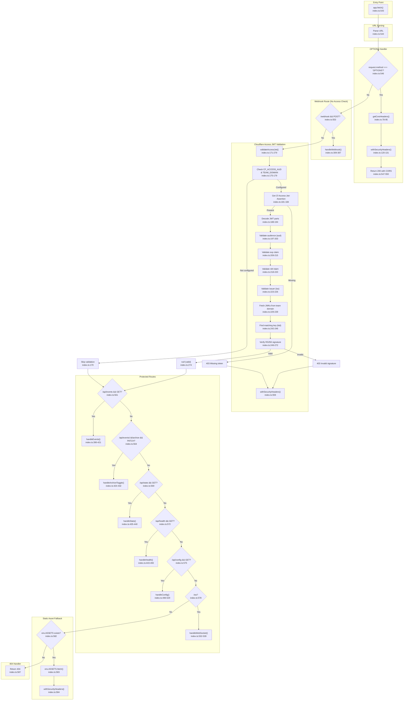

# HTTP Router and Security Flowchart

## Sources Consulted

| File | Lines Read |
|------|------------|
| `src/index.ts` | 1-602 (entire file) |

## Flowchart

## Route Summary

| Route | Method | Handler | Access Protected | Line |
|-------|--------|---------|------------------|------|
| `OPTIONS *` | OPTIONS | CORS preflight | No | 546-550 |
| `/webhook` | POST | `handleWebhook()` | No (token auth) | 553-554 |
| `/api/events` | GET | `handleEvents()` | Yes | 561-562 |
| `/api/events/:id/archive` | PATCH | `handleArchiveToggle()` | Yes | 564-567 |
| `/api/stats` | GET | `handleStats()` | Yes | 569-570 |
| `/api/health` | GET | `handleHealth()` | Yes | 572-573 |
| `/api/config` | GET | `handleConfig()` | Yes | 575-576 |
| `/ws` | GET | `handleWebSocket()` | Yes | 578-579 |
| `*` (fallback) | * | Static assets or 404 | Yes | 582-587 |

## Security Middleware

1. **SECURITY_HEADERS** (lines 32-70): CSP, HSTS, X-Frame-Options, X-Content-Type-Options, Referrer-Policy, Permissions-Policy
2. **CORS** (lines 78-95): Same-origin only
3. **JWT Validation** (lines 171-279): Cloudflare Access JWT verification with RS256 signature
4. **Webhook Token Auth** (lines 327-348): Constant-time HMAC-SHA256 comparison

## External Dependencies

| Dependency | File | Called From | Purpose |
|------------|------|-------------|---------|
| `validateWebhookPayload()` | `src/types.ts` | `handleWebhook():358` | Validates webhook payload |
| `insertEvent()` | `src/events.ts` | `handleWebhook():377` | Persists event to D1 |
| `fetchEvents()` | `src/events.ts` | `handleEvents():419` | Retrieves events from D1 |
| `toggleArchive()` | `src/events.ts` | `handleArchiveToggle():427` | Toggles archive status |
| `fetchEventStats()` | `src/events.ts` | `handleStats():438` | Retrieves aggregated stats |
| `DashboardRoom` | `src/DashboardRoom.ts` | Multiple handlers | Durable Object for WebSocket |
