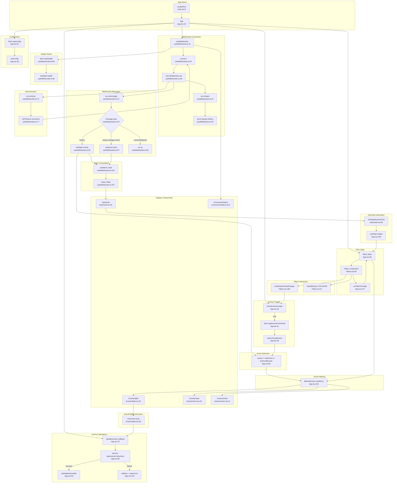

# React Dashboard Flowchart

## Sources Consulted

| File | Lines Read |
|------|------------|
| `src/main.tsx` | 1-14 |
| `src/components/dashboard/App.tsx` | 1-415 |
| `src/hooks/useWebSocket.ts` | 1-169 |
| `src/components/dashboard/Filters.tsx` | 1-245 |
| `src/components/dashboard/EventsTable.tsx` | 1-348 |
| `src/components/dashboard/KpiCards.tsx` | 1-136 |
| `src/components/dashboard/EventsChart.tsx` | 1-211 |
| `src/components/dashboard/ActionsChart.tsx` | 1-103 |
| `src/components/dashboard/ConnectionStatus.tsx` | 1-15 |
| `src/types.ts` | 1-316 |

## Flowchart

## External Dependencies (Backend Calls)

| Endpoint | Method | Called From | Purpose |
|----------|--------|-------------|---------|
| `/ws` | WebSocket | `useWebSocket.ts:28` | Real-time event stream |
| `/api/health` | GET | `useWebSocket.ts:89` | Health check |
| `/api/config` | GET | `App.tsx:61` | App configuration |
| `/api/events?archived=true` | GET | `App.tsx:41` | Fetch archived events |
| `/api/events/:id/archive` | PATCH | `App.tsx:82` | Archive/unarchive event |

## WebSocket Message Types

| Type | Direction | Purpose |
|------|-----------|---------|
| `request-history` | Client → Server | Request event history |
| `history` | Server → Client | Initial event list (up to 200) |
| `setup-manager-event` | Server → Client | New event broadcast |
| `connected` | Server → Client | Connection confirmation |
| `ping` / `pong` | Bidirectional | Keep-alive |

## Data Flow Summary

1. App mounts → establishes WebSocket connection
2. WebSocket receives history → populates events state
3. New events broadcast → prepended to events
4. Filters applied via useMemo → filteredEvents
5. Components render filteredEvents
6. Archive operations use optimistic updates with rollback
