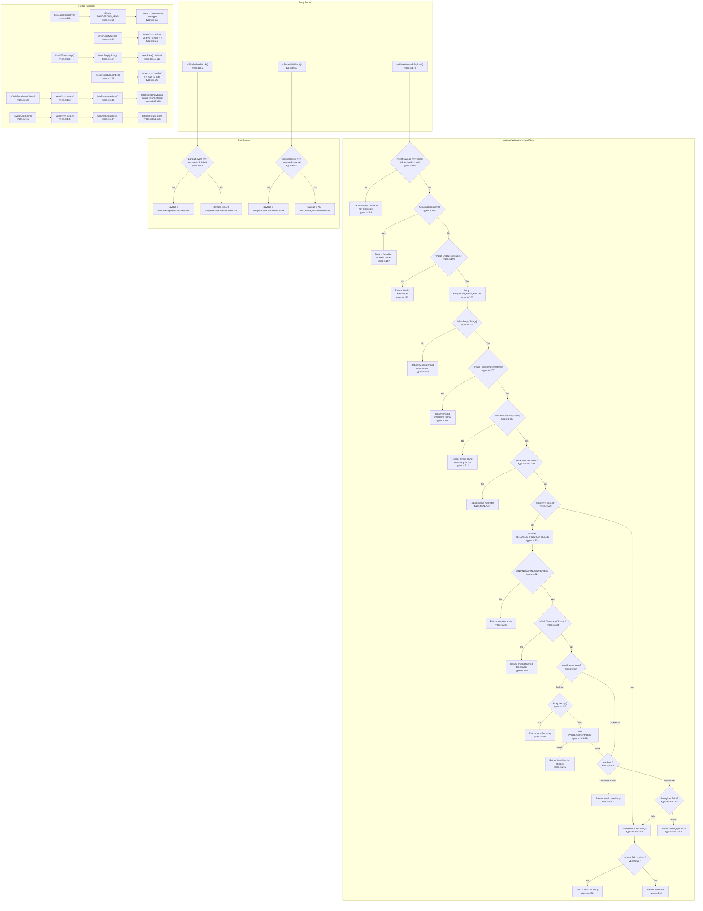

# Shared Types and Validation Flowchart

## Sources Consulted

| File | Line Range | Purpose |
|------|-----------|---------|
| `src/types.ts` | 1-316 | Full file - validation logic, type guards, type definitions |
| `src/index.ts` | 350-387 | validateWebhookPayload caller in webhook handler |

## Flowchart

## Callers

### `validateWebhookPayload()` Callers

| File | Line | Context |
|------|------|---------|
| `src/index.ts` | 358 | Webhook handler - validates incoming POST |

### `isFinishedWebhook()` Callers

| File | Line | Context |
|------|------|---------|
| `src/events.ts` | 46 | Filters for finished webhooks |
| `src/components/dashboard/EventsTable.tsx` | 145, 295 | Row rendering |
| `src/components/dashboard/EventsChart.tsx` | 122 | Filters for chart |
| `src/components/dashboard/App.tsx` | 164, 191, 192 | Filter logic |
| `src/components/dashboard/ActionsChart.tsx` | 24 | Filters for chart |
| `src/hooks/useWebSocket.ts` | 131 | Stats computation |

### `isStartedWebhook()` Callers

**None found** — appears unused in production code.

## Security Features

1. **Prototype pollution guard**: `hasDangerousKeys()` rejects `__proto__`, `constructor`, `prototype`
2. **Nested object validation**: `isValidEnrollmentAction()` and `isValidUserEntry()` also check for dangerous keys
3. **Timestamp validation**: Prevents invalid date injection
4. **Type narrowing**: Type guards enable safe property access after validation
