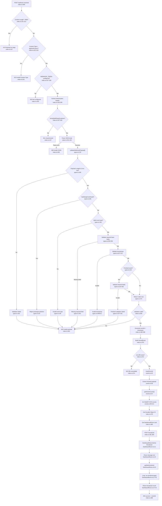

# Webhook Ingestion Flowchart

## Sources Consulted

| File | Line Range | Purpose |
|------|------------|---------|
| `src/index.ts` | 1-163, 280-400 | Main worker entry, `handleWebhook()`, helper functions |
| `src/types.ts` | 1-273 | `validateWebhookPayload()` and supporting validators |
| `src/events.ts` | 1-152 | `insertEvent()` D1 persistence |
| `src/DashboardRoom.ts` | 1-43 | Durable Object `/broadcast` handler |

## Flowchart

## External Dependencies

| Dependency | Location | Purpose |
|------------|----------|---------|
| `timingSafeEqual()` | `index.ts:138-163` | Constant-time token comparison via HMAC-SHA256 |
| `insertEvent()` | `events.ts:91` | D1 persistence |
| `DashboardRoom` | `DashboardRoom.ts` | WebSocket broadcast |

## Side Effects

1. **D1 Write**: `insertEvent()` at `events.ts:99-151` writes 23 columns to the `events` table
2. **Durable Object Call**: `DashboardRoom.fetch("/broadcast")` triggers WebSocket broadcast to all connected clients
