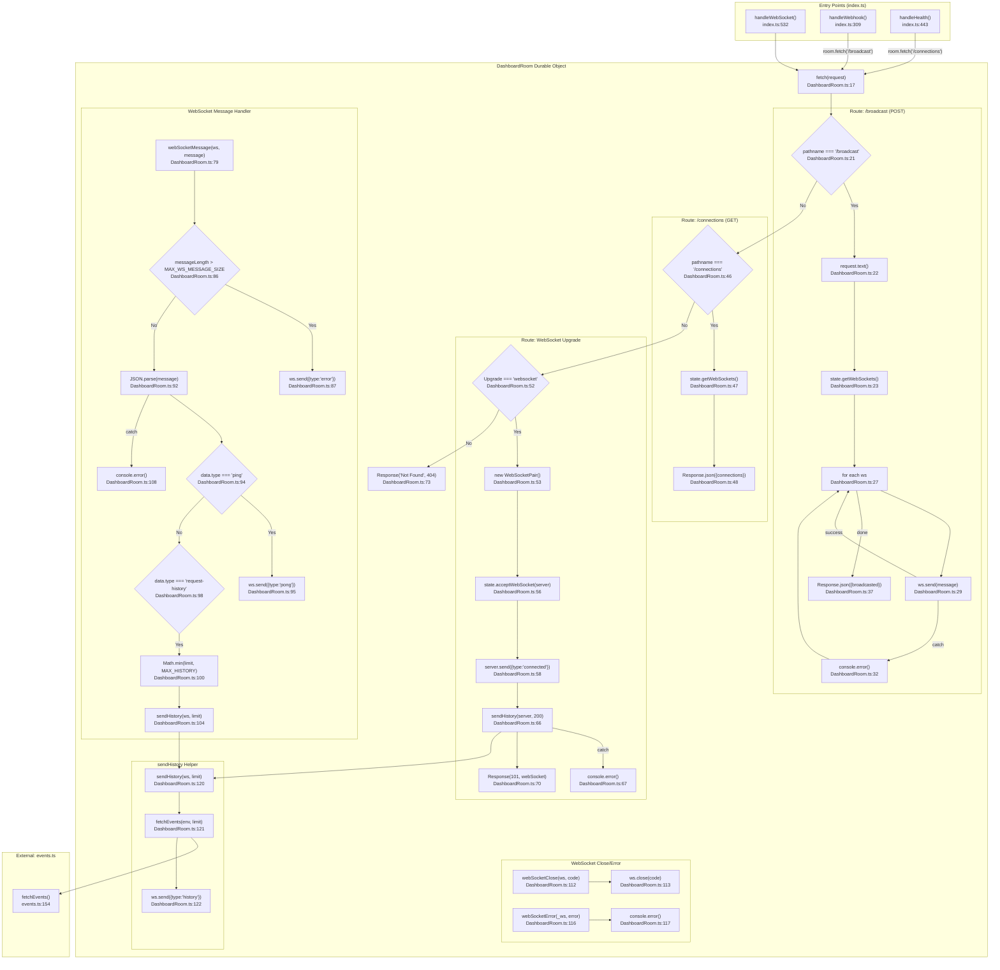

# WebSocket Hub (Durable Object) Flowchart

## Sources Consulted

| File | Line Range | Purpose |
|------|-----------|---------|
| `src/DashboardRoom.ts` | 1-124 | Entire Durable Object implementation |
| `src/events.ts` | 1-241 | External dependency `fetchEvents()` for history |
| `src/index.ts` | 1-602 | Worker entry points that invoke DashboardRoom |

## Flowchart

## External Dependencies

| Dependency | File:Line | Called From | Purpose |
|------------|-----------|-------------|---------|
| `fetchEvents()` | `events.ts:154` | `DashboardRoom.ts:121` | Retrieves stored events from D1 for history |
| `StoredEvent` type | `types.ts` | `DashboardRoom.ts:1` | Type import for event structure |

## Side Effects

1. **WebSocket sends** (broadcast messages to all connected clients)
2. **WebSocket sends** (connected confirmation, history data, pong response, error message)
3. **Hibernation state** via `state.acceptWebSocket()` (enables Durable Object hibernation API)
4. **D1 database reads** via `fetchEvents()`
