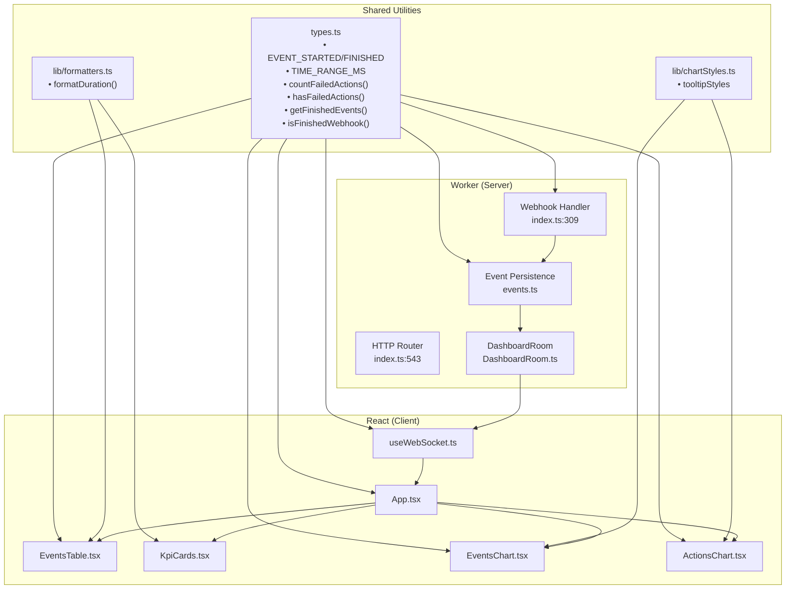

# Unified Architecture Proposal

Based on duplication analysis. This proposal consolidates accidental divergence while preserving legitimate specialization.

## Consolidated Components

### 1. Shared Formatters (`src/lib/formatters.ts`)

**Target:** New file

**Consolidates:**
- `KpiCards.tsx:28-33` — `formatDuration`
- `EventsTable.tsx:108-114` — `formatDuration`

**Proposed implementation:**
```typescript
export function formatDuration(seconds: number | undefined, fallback = "—"): string {
  if (seconds === undefined || seconds === 0) return fallback;
  if (seconds < 60) return `${seconds}s`;
  const mins = Math.floor(seconds / 60);
  const secs = seconds % 60;
  return `${mins}m ${secs}s`;
}
```

**Call site changes:**
- `KpiCards.tsx:28-33` → `import { formatDuration } from "@/lib/formatters"`
- `EventsTable.tsx:108-114` → `import { formatDuration } from "@/lib/formatters"`

**Capability loss:** None.

---

### 2. Action Utilities (`src/types.ts` additions)

**Target:** `src/types.ts` (existing file)

**Consolidates:**
- `events.ts:53-58` — `getActionCounts`
- `useWebSocket.ts:143-146` — failed action reduce
- `EventsTable.tsx:147` — failed count filter
- `App.tsx:167-169` — failed action check
- `EventsChart.tsx:144` — hasFailed check
- `ActionsChart.tsx:32-33` — status check

**Proposed additions to `types.ts`:**
```typescript
export function countFailedActions(actions: EnrollmentAction[] | undefined): number {
  return (actions ?? []).filter((a) => a.status === "failed").length;
}

export function hasFailedActions(actions: EnrollmentAction[] | undefined): boolean {
  return (actions ?? []).some((a) => a.status === "failed");
}

export function getFinishedEvents(
  events: StoredEvent[]
): (StoredEvent & { payload: SetupManagerFinishedWebhook })[] {
  return events.filter(
    (e): e is StoredEvent & { payload: SetupManagerFinishedWebhook } =>
      isFinishedWebhook(e.payload)
  );
}
```

**Call site changes:**
- `events.ts:53-58` → use `countFailedActions`
- `useWebSocket.ts:143-146` → use `countFailedActions` in reduce
- `EventsTable.tsx:147` → `countFailedActions(actions)`
- `App.tsx:167-169` → `hasFailedActions(payload.enrollmentActions)`
- `EventsChart.tsx:144` → `hasFailedActions(actions)`
- `useWebSocket.ts:129-132` → `getFinishedEvents(state.events)`
- `EventsChart.tsx:120-123` → `getFinishedEvents(events)`
- `ActionsChart.tsx:22-24` → `getFinishedEvents(events)`

**Capability loss:** None.

---

### 3. Event Type Constants (`src/types.ts` exports)

**Target:** `src/types.ts` (existing file)

**Consolidates:**
- `types.ts:101-104` — `VALID_EVENTS` (currently not exported)
- `events.ts:165-171` — string literals
- `useWebSocket.ts:127` — string literal
- `App.tsx:157-160` — string literals

**Proposed change:** Export existing constants and add named exports.

```typescript
// Already exists at types.ts:101-104, change to:
export const EVENT_STARTED = "com.jamf.setupmanager.started" as const;
export const EVENT_FINISHED = "com.jamf.setupmanager.finished" as const;
export const VALID_EVENTS = [EVENT_STARTED, EVENT_FINISHED] as const;
```

**Call site changes:**
- `events.ts:166` → `bindings.push(EVENT_STARTED)`
- `events.ts:171` → `bindings.push(EVENT_FINISHED)`
- `useWebSocket.ts:127` → `e.payload.event === EVENT_STARTED`
- `App.tsx:157` → `payload.event !== EVENT_STARTED`
- `App.tsx:160` → `payload.event !== EVENT_FINISHED`

**Capability loss:** None.

---

### 4. Time Range Constants (`src/types.ts` exports)

**Target:** `src/types.ts` (existing file)

**Consolidates:**
- `events.ts:81-89` — `getTimeRangeCutoff` constants
- `App.tsx:182-185` — inline ranges object
- `EventsChart.tsx:128-136` — cutoff constants

**Proposed addition:**
```typescript
export const TIME_RANGE_MS = {
  hour: 3_600_000,
  day: 86_400_000,
  week: 604_800_000,
  month: 2_592_000_000,
} as const;
```

**Call site changes:**
- `events.ts:83-87` → `const ranges = TIME_RANGE_MS`
- `App.tsx:183` → `const ranges = TIME_RANGE_MS`
- `EventsChart.tsx:129-134` → use `TIME_RANGE_MS.day`, `TIME_RANGE_MS.week`

**Capability loss:** None.

---

### 5. Chart Styles (`src/lib/chartStyles.ts`)

**Target:** New file

**Consolidates:**
- `EventsChart.tsx:83-90` — tooltip styles
- `ActionsChart.tsx:69-76` — tooltip styles

**Proposed implementation:**
```typescript
export const tooltipStyles = {
  contentStyle: {
    backgroundColor: "var(--surface-overlay)",
    border: "1px solid var(--edge)",
    borderRadius: "12px",
    fontSize: "14px",
    padding: "12px 16px",
  },
  labelStyle: {
    color: "var(--ink)",
    fontWeight: 600,
    marginBottom: "4px",
  },
} as const;
```

**Call site changes:**
- `EventsChart.tsx:83-90` → `{...tooltipStyles}`
- `ActionsChart.tsx:69-76` → `{...tooltipStyles}`

**Capability loss:** None.

---

### 6. Dead Code Removal

**Target:** `src/types.ts:60-64`

**Action:** Remove `isStartedWebhook` type guard — no callers found in production code.

---

## Not Unified (Legitimate Specialization)

### Event Filtering (Server vs Client)

**Server:** `events.ts:165-177` — SQL WHERE clauses for D1 performance  
**Client:** `App.tsx:156-171` — In-memory filter for WebSocket events

**Reason:** Different execution contexts. Server needs SQL; client needs JavaScript. Forcing a shared abstraction would add complexity without benefit.

### Success Rate Calculation

**Server:** `events.ts:276-281` — Historical accuracy from D1  
**Client:** `useWebSocket.ts:152-155` — Real-time from WebSocket

**Reason:** Different data sources with different freshness guarantees. The slight formula difference (fallback when no finished events) reflects legitimate semantic differences. Could share the formula but would need to handle the edge cases in callers anyway.

---

## Unified Flowchart

After applying proposals, the architecture simplifies to:



## Impact Summary

| Change | Files Modified | Lines Changed (est.) | Risk |
|--------|----------------|---------------------|------|
| Create `lib/formatters.ts` | 1 new + 2 modified | ~20 | Low |
| Add action utilities to `types.ts` | 1 modified + 6 call sites | ~40 | Low |
| Export event constants | 1 modified + 5 call sites | ~15 | Low |
| Export time range constants | 1 modified + 3 call sites | ~15 | Low |
| Create `lib/chartStyles.ts` | 1 new + 2 modified | ~15 | Low |
| Remove dead code | 1 modified | -10 | Low |

**Total:** 3 new files, ~8 files modified, ~95 lines net change.

All changes are low-risk refactors with no behavioral changes. Each can be done independently and verified with existing tests.
